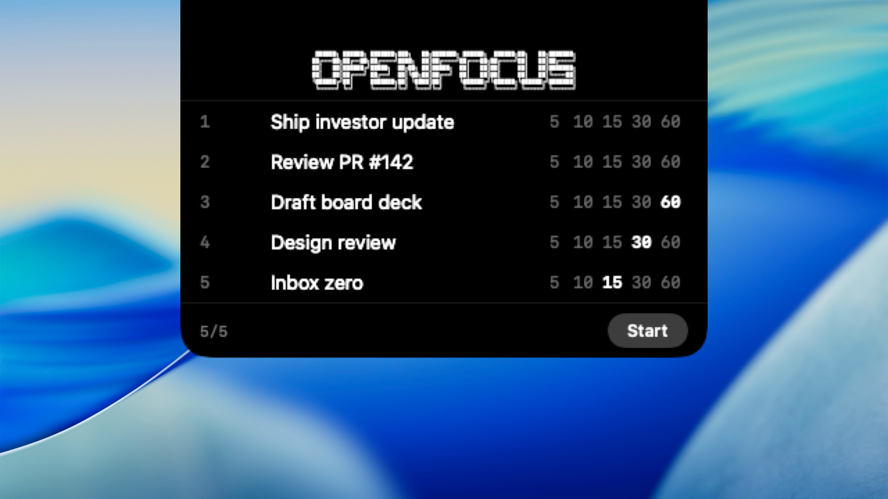
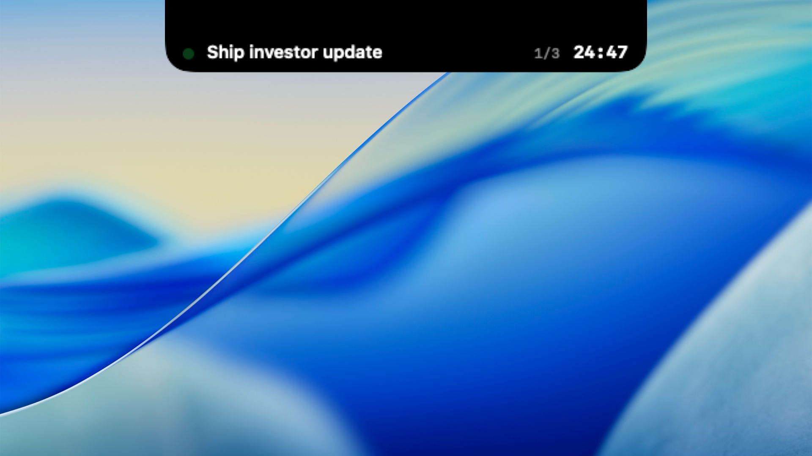
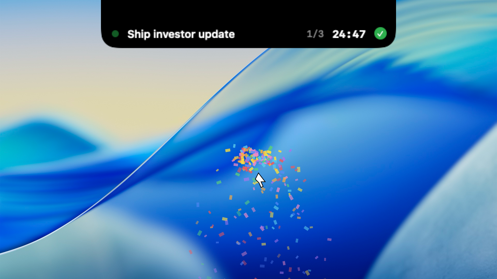

<div align="center">
<pre>
 ██████╗ ██████╗ ███████╗███╗   ██╗███████╗ ██████╗  ██████╗██╗   ██╗███████╗
██╔═══██╗██╔══██╗██╔════╝████╗  ██║██╔════╝██╔═══██╗██╔════╝██║   ██║██╔════╝
██║   ██║██████╔╝█████╗  ██╔██╗ ██║█████╗  ██║   ██║██║     ██║   ██║███████╗
██║   ██║██╔═══╝ ██╔══╝  ██║╚██╗██║██╔══╝  ██║   ██║██║     ██║   ██║╚════██║
╚██████╔╝██║     ███████╗██║ ╚████║██║     ╚██████╔╝╚██████╗╚██████╔╝███████║
 ╚═════╝ ╚═╝     ╚══════╝╚═╝  ╚═══╝╚═╝      ╚═════╝  ╚═════╝ ╚═════╝ ╚══════╝
</pre>

**Focus on the Big 5 things that matter today.**





[](https://github.com/fillsoko/open-focus/releases/latest)
&nbsp;


</div>

---

## Why

Todo apps buried in sidebars don't get opened. Timer apps ask you to think about the timer. OpenFocus lives in the one piece of screen real-estate you can't hide from — the notch — and turns it into a stopwatch for the five things that actually matter today. No windows, no dock icon, no thinking about the tool.

## Features

|  |  |  |
|:--:|:--:|:--:|
| 🎯 **Big 5 only** | ⚡ **Keyboard-first** | 🕹️ **Notch-native** |
| One screen. Five tasks. That's the day. | Tab, Enter, arrows, number keys. Zero mouse. | The notch *is* the app. Nothing else on screen. |
| 🎉 **Confetti reward** | 🚀 **Launch at login** | 🔄 **Auto-update** |
| Click ✓ — cannon fires from your cursor. | Menu-bar toggle, powered by `SMAppService`. | Checks GitHub Releases from the menu. |

## Keyboard

| Key | In text field | In time chip |
|---|---|---|
| **Tab** | → time chip of same row | → next row's text (wraps) |
| **Enter** | → time chip of same row | → next row's text · on row 5 → **start** |
| **↑ ↓** | prev / next row | prev / next row's time chip (wraps) |
| **← →** | cursor movement (→ at end → time chip) | cycle 5 / 10 / 15 / 30 / 60 |
| **0–9** | type | prefix-match (`1` → 10, `1` `5` → 15) |
| **⌘↩** | start session | start session |

## Install

**Download the DMG** from the [latest release](https://github.com/fillsoko/open-focus/releases/latest), drag `OpenFocus.app` to `Applications`, launch.

> **First launch — macOS Gatekeeper**
> OpenFocus is a free, open-source app and is **not distributed through the Mac App Store**, and it isn't signed with an Apple Developer ID (I'd rather not pay Apple $99/yr to ship a free notch timer). On first launch macOS will refuse to open it with a message like *"cannot be opened because Apple cannot check it for malicious software"*.
>
> To allow it:
> 1. Try to open OpenFocus once (it will be blocked — that's expected).
> 2. Open **System Settings → Privacy & Security**.
> 3. Scroll down to the *Security* section — you'll see a note about OpenFocus being blocked. Click **Open Anyway**.
> 4. Confirm with your password / Touch ID.
>
> You only need to do this once. Alternatively: right-click `OpenFocus.app` → **Open** → **Open** in the dialog.

Or build from source:

```bash
git clone https://github.com/fillsoko/open-focus.git
cd open-focus
./scripts/build_app.sh   # produces dist/OpenFocus.app
```

Requires Xcode command-line tools · macOS 13 (Ventura) or later.

## Built with

Swift 5.9 · SwiftUI · AppKit · `NSPanel` overlay · `SMAppService` · zero third-party dependencies.

## License

[MIT](LICENSE)
